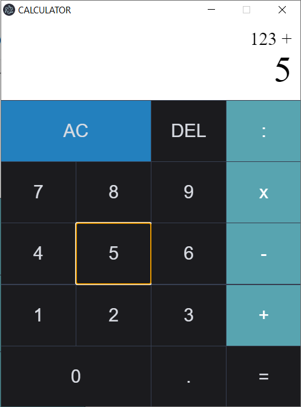

# simple-calculator-javascript

## Introduction
This is a simple desktop calculator build with electron js

## Tech
- Node js
- electron js

## How to use
- install packages
`npm install`
- run script
`npm start` or `electron .`

## Still need to fix
- Display screen will be overflowed with large number 